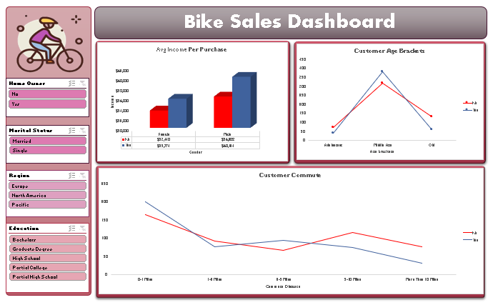

# 🚲 Bike Purchase Behavior Analysis

## 📌 Project Overview
This project analyzes demographic and socioeconomic factors influencing bike purchasing decisions. The analysis is built within a single, comprehensive Excel workbook that covers the entire data lifecycle from raw ingestion to final visualization.

## 📊 Visual Dashboard
Below is a preview of the interactive dashboard showing the relationship between income, age, and commute distance:

## 📁 Repository Structure
- **`Data/`**: Contains the main file `Bike_Buyers_Analysis.xlsx` (includes Raw Data, Working Sheet, and Pivot Tables).
- **`visuals/`**: Contains dashboard screenshots and supporting charts.
- **`README.md`**: Project documentation and key insights.

## ⚙️ Data Lifecycle (Inside the Excel File)
The workbook is organized into logical stages to ensure data integrity:
1. **Raw Data (`bike_buyers`)**: The original dataset of 1,000 customers.
2. **Data Cleaning (`Working Sheet`)**: 
   - Standardized Marital Status (M/S) and Gender (M/F).
   - Removed duplicate records.
   - **Feature Engineering**: Created `Age Brackets` using nested IF statements to segment customers into Adolescent, Middle Age, and Old.
3. **Analysis (`Pivot Tables`)**: Summarized views for average income per purchase and commute distance impact.
4. **Final Report (`Dashboard`)**: Interactive visual charts with slicers for dynamic filtering.

## 📈 Key Insights
- **Income Level:** Customers who bought bikes earn **~5.6% more** on average than those who didn't.
- **Commute Distance:** The "Sweet Spot" for bike sales is among customers living within **0-1 miles** of work.
- **Age Demographic:** **Middle-aged** individuals are the most active buyers, making up the largest portion of sales.

## 🛠️ How to Access
1. Navigate to the `Data/` folder.
2. Download `Bike_Buyers_Analysis.xlsx`.
3. Open in Microsoft Excel to interact with the slicers and pivot tables.
